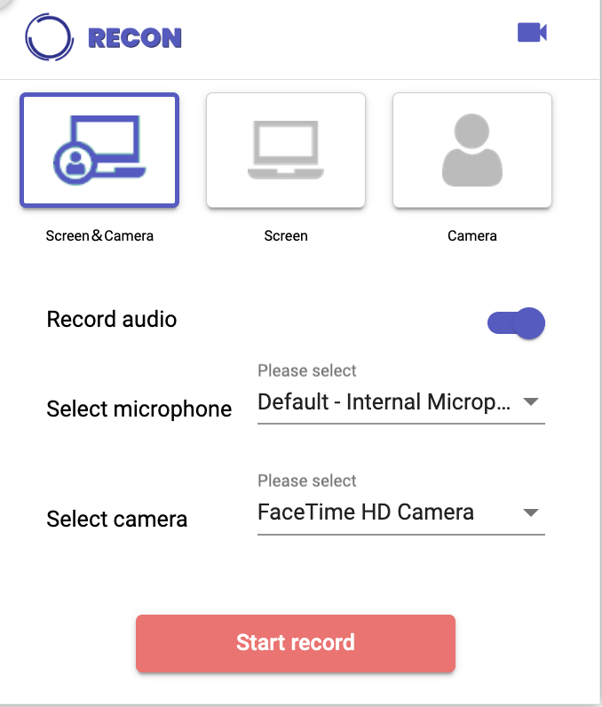

## RECON - Video recording tool for Chrome extension
<b>※ This source code supports only manifest v2.</b>

### About RECON
RECON is software that runs as a Google Chrome extension.  
RECON supports Screen only, Screen and Camera, Camera only data can be taken and <b>webm</b> files can be downloaded to your own computer. 


### How to build
```bash
./build.sh --install
./build.sh --build
```

You can upload a `dist-dev` package to [chrome://extensions/](chrome://extensions)

### Sample Images


### Smample Video

